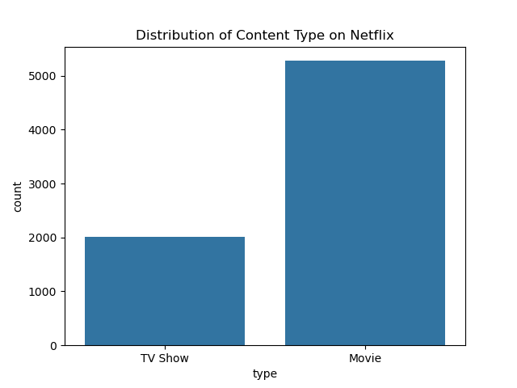
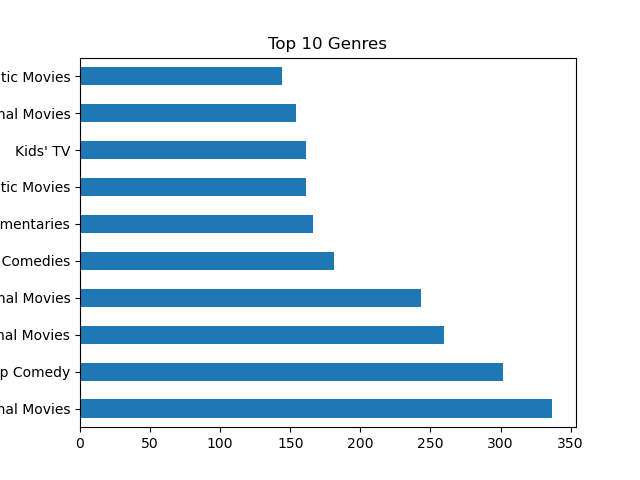
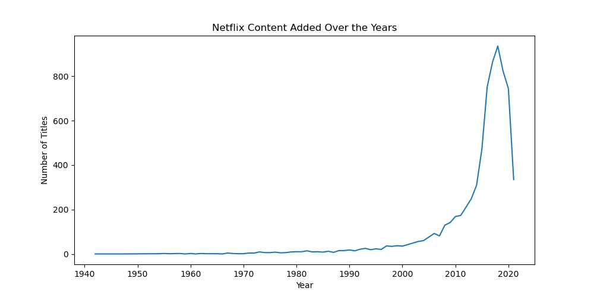
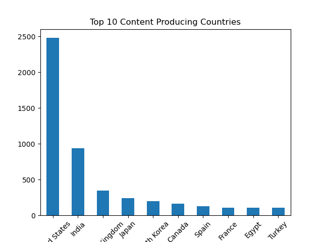

# Netflix Titles EDA Project

## Project Overview
Exploratory Data Analysis (EDA) of the Netflix titles dataset to uncover trends in content type, genres, release years, and production countries.

## Dataset
- Source: [Netflix Titles on Kaggle](https://www.kaggle.com/datasets/shivamb/netflix-shows)
- ~8,800 records of TV Shows and Movies

## Tools & Technologies
- Python 3.12
- Pandas, Matplotlib, Seaborn
- Jupyter / Spyder
- Git, GitHub

## Data Cleaning Summary
- Dropped rows with missing values
- Removed `director` column (29.91% missing values)

## Visualizations

### Type Distribution

### Top 10 Genres

### Year-wise Content Release

### Top Producing Countries

## Project Structure

netflix-eda-project/
│
├── netflix_eda.py # Main Python script with full EDA
├── netflix_titles.csv # Raw dataset from Kaggle
├── results/ # Folder containing saved plot images
│ ├── type_distribution.png
│ ├── top_genres.png
│ ├── release_trend.png
│ └── top_countries.png
└── README.md # Project documentation

## Author
**Sheshank Priyadarshi**  
- [GitHub](https://github.com/Sheshank212)  
- [LinkedIn](https://www.linkedin.com/in/sheshank3)

## License
MIT
